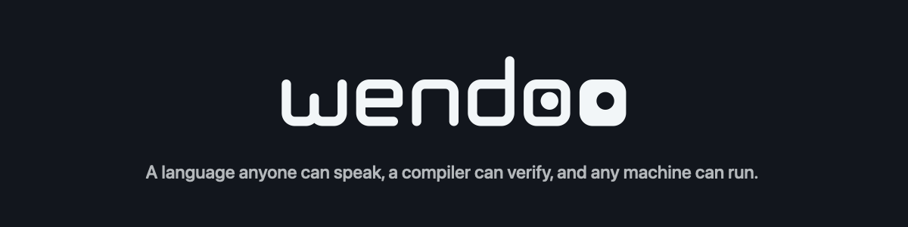

<div align="center">
  <a href="https://wendoo.com"></a>
</div>

# Wendoo Language

A tile-based programming language for creative coding applications.

<div align="center">
  
</div>

Wendoo programs are built by arranging **tiles** -- typed, composable tokens -- into **rules**. Each rule has a WHEN side (condition) and a DO side (action). A collection of rules forms a **brain** that drives an autonomous actor. Host applications extend the language with custom types, sensors, and actuators.

The core library compiles to Roblox (Luau), Node.js, and browser (ESM) targets from a single TypeScript codebase.

The companion [wendoo-mcu](https://github.com/wendoo-lang/wendoo-mcu) repository extends Wendoo to embedded hardware, starting with the BBC micro:bit: a native C++ implementation of the bytecode VM that runs brains on the device, plus a browser simulator and CODAL-inspired web device runtime for authoring and testing. A brain you build and test in the browser flashes to a real micro:bit over WebUSB and runs unchanged.

Wendoo draws inspiration from other tile-based programming systems past and present, including [Kodu Game Lab](https://www.kodugamelab.com/), [Project Spark](https://en.wikipedia.org/wiki/Project_Spark) ([Wiki](https://projectspark.fandom.com/wiki/How_the_brains_work)), and [MicroCode](https://microbit-apps.org/microcode-classic/docs/language).

## Demos

- [Ecosystem Demo](https://ecosim.playwendoo.com) -- carnivores, herbivores, and plants driven by user-editable Wendoo brains
- [Code a BBC micro:bit](https://microbit.playwendoo.com) -- program a micro:bit with Wendoo in your browser, then flash the brain to real hardware ([wendoo-mcu](https://github.com/wendoo-lang/wendoo-mcu))

## Packages

| Package | Description |
|---------|-------------|
| [@wendoo/core](packages/core/) | Wendoo Language runtime -- tiles, parser, compiler, VM (multi-target: Roblox, Node.js, ESM) |
| [@wendoo/app-host](packages/app-host/) | Project management, workspace storage, and IDB persistence for Wendoo apps |
| [@wendoo/ui](packages/ui/) | Shared React UI -- shadcn/ui primitives + brain editor components |
| [@wendoo/docs](packages/docs/) | Shared documentation subsystem -- renders as in-app sidebar or full-screen SPA |
| [@wendoo/ts-compiler](packages/ts-compiler/) | TypeScript-to-Wendoo bytecode compiler |
| [@wendoo/assistant-bridge](packages/assistant-bridge/) | Assistant bridge -- the open tool contract, catalog digest, trace summarizer, target adapter interface, and rehearsal adapter kit |
| [@wendoo/assistant-relay](packages/assistant-relay/) | Assistant relay protocol -- the session handshake, turn events, and tool-call wire an assistant service speaks with a client |
| [@wendoo/service-api](packages/service-api/) | Request/response schemas, shared enums, error shapes, and serialization formats for backend service APIs |
| [@wendoo/cli](packages/cli/) | Command-line tools for Wendoo projects |
| [@wendoo/bridge-protocol](packages/bridge-protocol/) | VS Code bridge network protocol types and schemas |
| [@wendoo/bridge-client](packages/bridge-client/) | Client SDK for the VS Code bridge |
| [@wendoo/bridge-app](packages/bridge-app/) | Opinionated layer atop bridge-client for the VS Code bridge |

## Apps

| App | Description |
|-----|-------------|
| [Ecosystem Sim](apps/ecosim/) | Demo: carnivores, herbivores, and plants driven by user-editable Wendoo brains |
| [Ecosystem Sim for Roblox](apps/ecosim-rbx/) | Roblox projection of the Ecosystem Sim, built on the core library's Luau target |
| [VS Code Extension](apps/vscode-extension/) | Author Wendoo sensors and actuators in TypeScript using VS Code Web ([Marketplace](https://marketplace.visualstudio.com/items?itemName=wendoo.wendoo-vscode-extension)) |
| [VS Code Bridge](apps/vscode-bridge/) | Bridge server that relays between the VS Code extension and Wendoo apps |

## Getting Started

Install the packages you need:

```bash
# Core only (language runtime, compiler, VM)
npm install @wendoo/core

# Core + UI (adds brain editor and shadcn/ui components)
npm install @wendoo/core @wendoo/ui

# Full stack (adds documentation sidebar and renderer)
npm install @wendoo/core @wendoo/ui @wendoo/docs

# For VS Code integration, see apps/ecosim for example implementation.
```

For full setup instructions -- Vite config, TypeScript paths, Tailwind, and component usage -- see the [Integration Guide](INTEGRATION.md).

## Documentation

Documentation is a work in progress. Browse the sim demo's [language documentation](https://ecosim.playwendoo.com/docs) online. See also the [core package README](packages/core/README.md) for language architecture, the [ui package README](packages/ui/README.md) for the shared React components, and the [docs package README](packages/docs/README.md) for the documentation system.

## Contributing

To report a bug or request a feature, please [open an issue](https://github.com/wendoo-lang/wendoo-lang/issues).

## License

[MIT](LICENSE)
